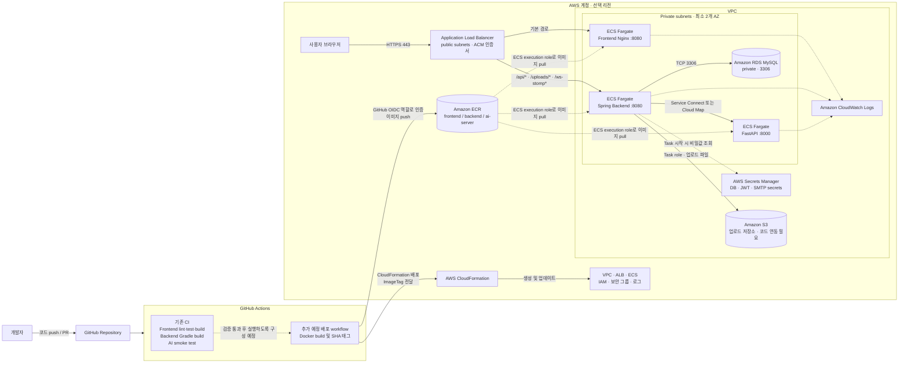

# UNI-VERSE AWS 배포 아키텍처

발표 대본은 [ARCHITECTURE_PRESENTATION_SCRIPT.md](ARCHITECTURE_PRESENTATION_SCRIPT.md)를 참고하세요.

## 1. 목표 구성

UNI-VERSE는 React 프론트엔드, Spring Boot API, FastAPI AI 서비스를 각각 Docker 이미지로 빌드합니다. 이미지는 Amazon ECR에 저장하고, Amazon ECS Fargate가 실행합니다. AWS CloudFormation은 네트워크와 AWS 리소스를 선언적으로 생성하며, ECS Task Definition에서 실행할 ECR 이미지 URI를 지정합니다.

> Docker 이미지를 CloudFormation에 등록하는 구조는 아닙니다. Docker 이미지는 ECR에 push하고, CloudFormation은 ECR URI를 참조하는 ECS 리소스를 배포합니다.

## 2. 전체 아키텍처

## 3. 배포 흐름

### 3-1. 현재 저장소에서 동작하는 CI

GitHub Actions는 frontend lint/test/build, backend Gradle build, AI smoke test를 수행합니다. 현재 workflow는 Docker 이미지를 ECR에 push하거나 CloudFormation stack을 배포하지 않습니다.

### 3-2. 목표 배포 흐름

1. GitHub Actions가 세 서비스의 Docker 이미지를 빌드하고 Git commit SHA를 이미지 태그로 사용합니다.
2. GitHub Actions는 AWS IAM OIDC 역할로 임시 자격 증명을 받아 세 이미지를 ECR에 push합니다. 장기 AWS access key를 GitHub secret으로 저장하지 않는 구성을 권장합니다.
3. 배포 workflow가 CloudFormation에 이미지 태그와 환경별 파라미터를 전달합니다.
4. CloudFormation이 ECS Task Definition을 갱신하고 ECS Service의 rolling deployment를 실행합니다.
5. ALB health check가 통과하면 배포를 완료하고, 실패 시 이전 Task Definition revision과 이미지 태그로 롤백합니다.

### 3-3. CloudFormation 스택 구분

이미지 저장소는 애플리케이션 배포 전에 존재해야 하므로 기반 리소스와 애플리케이션 리소스를 분리하는 구성을 권장합니다.

| 스택 | 포함할 리소스 | 생성 시점 |
|---|---|---|
| `universe-foundation` | VPC 또는 기존 VPC 연결, 서브넷, 보안 그룹, ECR 저장소, ECS Cluster, ALB, IAM 역할, CloudWatch 로그 그룹, Secrets Manager secret, RDS | 최초 1회 및 인프라 변경 시 |
| `universe-app` | ECS Task Definition, ECS Service, Target Group 연결, ALB listener rule | 이미지를 ECR에 push한 뒤 매 배포 |

RDS는 데이터가 있는 상태에서 stack 교체나 삭제가 발생하지 않도록 deletion protection과 `Retain` 정책을 설정합니다. RDS 자격 증명, JWT 키, SMTP 자격 증명은 템플릿에 평문으로 기록하지 않습니다.

## 4. 네트워크 및 트래픽

- ALB만 public subnet에 배치하고 HTTPS `443`으로 인터넷 트래픽을 받습니다. HTTP `80`을 열 경우 HTTPS redirect 용도로만 사용합니다.
- ECS task와 RDS는 private subnet에 두며 public IP를 할당하지 않습니다. Fargate 서비스의 AZ 분산을 위해 private subnet은 서로 다른 AZ에 둡니다.
- Public IP가 없는 ECS task가 AWS API에 접근할 수 있도록 ECR API, ECR DKR, CloudWatch Logs, Secrets Manager Interface VPC Endpoint와 S3 Gateway Endpoint를 구성하는 방안을 권장합니다. Endpoint를 사용하지 않는 AWS API 경로는 NAT Gateway로 제공할 수 있습니다.
- SMTP 서버처럼 AWS 외부 서비스로 나가는 연결에는 NAT Gateway 등 outbound 인터넷 경로가 필요합니다. VPC endpoint는 외부 SMTP 연결을 대체하지 않습니다.
- ALB 경로 우선순위는 `/api/*`, `/uploads/*`, `/ws-stomp*`를 backend로 전달하고, 나머지는 frontend로 전달합니다. `/ws-stomp`는 채팅 WebSocket 연결에 사용됩니다.
- Frontend와 backend의 Target Group health check는 각각 `/health`, `/actuator/health/readiness`를 사용합니다. AI 서비스는 내부 호출 전용이며 `/health`를 상태 확인 경로로 사용합니다.

## 5. 보안 그룹 연결표

| 대상 보안 그룹 | 허용 출발지 | 포트 | 용도 |
|---|---|---:|---|
| ALB | 인터넷 | TCP 443 | HTTPS 사용자 요청 |
| ALB | 인터넷 | TCP 80 | 선택 사항: HTTPS redirect |
| Frontend ECS | ALB 보안 그룹 | TCP 8080 | 정적 웹 요청 |
| Backend ECS | ALB 보안 그룹 | TCP 8080 | API, 업로드, WebSocket |
| AI ECS | Backend ECS 보안 그룹 | TCP 8000 | 내부 AI 요청만 허용 |
| RDS | Backend ECS 보안 그룹 | TCP 3306 | MySQL 연결 |
| Interface VPC endpoints | 해당 ECS task 보안 그룹 | TCP 443 | Secrets Manager 등 AWS API 접근 시 |

보안 그룹은 위 연결에 필요한 inbound만 허용합니다. 서비스 간 통신에 `0.0.0.0/0` inbound 규칙을 사용하지 않습니다.

VPC endpoint의 보안 그룹은 ECS task 보안 그룹에서 오는 TCP `443`만 허용합니다. S3 Gateway Endpoint는 보안 그룹 대신 route table에 연결하고, endpoint policy와 task role에서 허용 버킷 및 prefix를 제한합니다.

## 6. RDS 및 비밀값

- 데이터베이스는 Amazon RDS for MySQL을 private subnet에 둡니다. `3306`은 backend ECS 보안 그룹에서만 접근할 수 있게 합니다.
- backend 환경 설정은 `DB_URL`, `DB_USERNAME`, `DB_PASSWORD`, `JWT_SECRET_KEY`, `AI_SERVER_BASE_URL`, `MAIL_HOST`, `MAIL_PORT`, `MAIL_USERNAME`, `MAIL_PASSWORD`, `MAIL_FROM`입니다.
- DB 암호, JWT 키, SMTP 자격 증명은 Secrets Manager에 저장하고 ECS Task Definition의 `secrets`로 주입합니다. 앱이 AWS API를 호출해야 하는 권한은 task role, 이미지 pull·로그·secret 주입에 필요한 권한은 task execution role에 부여합니다.
- **Task execution role:** ECR 이미지 pull, CloudWatch Logs 기록, Task Definition에 등록한 Secrets Manager 값 조회 등 컨테이너 시작에 필요한 최소 권한을 가집니다.
- **Backend task role:** 실행 중인 애플리케이션의 AWS API 권한입니다. S3 저장을 연동하면 상품 이미지와 신고 증빙에 필요한 bucket 및 object prefix로만 제한합니다. AWS API를 사용하지 않는 서비스 task에는 불필요한 권한을 주지 않습니다.
- **GitHub Actions 배포 role:** OIDC trust를 사용하고, 지정된 ECR 저장소에 이미지 push 및 지정된 CloudFormation stack 배포에 필요한 권한만 부여합니다. 장기 access key를 GitHub secret으로 저장하지 않습니다.
- backend가 시작되기 전에 `backend/src/main/resources/schema.sql`을 새 RDS 데이터베이스에 적용해야 합니다. 현재 Compose의 schema 마운트는 로컬 MySQL에만 적용됩니다.
- RDS의 다중 AZ, 백업 보존 기간, 암호화, 인스턴스 크기와 비용은 배포 환경 및 예산에 맞게 정합니다.

## 7. 서비스별 배치

| 서비스 | ECR 이미지 | ECS 포트 | 상태 확인 | 노출 범위 |
|---|---|---:|---|---|
| Frontend | `universe-frontend:<git-sha>` | 8080 | `GET /health` | ALB 경유 |
| Backend | `universe-backend:<git-sha>` | 8080 | `GET /actuator/health/readiness` | ALB 및 내부 서비스 |
| AI API | `universe-ai-server:<git-sha>` | 8000 | `GET /health` | VPC 내부 전용 |

세 이미지는 `linux/amd64`로 빌드하고 ECS Task Definition의 CPU architecture도 `X86_64`로 맞춥니다. ECS 서비스에는 재현과 롤백이 가능한 SHA 또는 release 태그를 지정하고 `latest`만 사용하지 않습니다.

## 8. 운영 전 확인이 필요한 항목

- **업로드 영속성:** 현재 backend는 `/app/uploads` 로컬 디스크에 파일을 저장합니다. Fargate task 교체나 수평 확장 시 파일 공유가 보장되지 않습니다. 운영 전에 S3 연동(권장) 또는 EFS 마운트를 구현해야 합니다. 위 다이어그램의 S3 연결은 목표 상태이며, 현재 앱 동작을 나타내지 않습니다.
- **S3 파일 범위:** 목표 구조에서 상품 이미지와 신고 증빙 파일은 S3에 저장하고, 데이터베이스에는 객체 key 또는 URL만 저장합니다. S3 task role, bucket policy, 업로드/조회 코드가 준비되기 전에는 S3를 사용 중인 것으로 간주하지 않습니다.
- **AI 모델 파일:** 현재 `ai-server/Dockerfile`이 `models` 디렉터리를 이미지에 복사합니다. 따라서 별도 S3 모델 다운로드는 현재 배포의 전제 조건이 아닙니다. 모델을 외부 저장소로 분리할 때만 전용 bucket 권한과 다운로드 절차를 설계합니다.
- **채팅 확장:** 현재 WebSocket 메시지 broker는 backend 프로세스 메모리에 있습니다. backend ECS desired count를 1로 유지하거나, 여러 task를 쓰기 전에 공유 broker로 전환해야 합니다.
- **인증 메일:** 운영에서는 SMTP 설정을 반드시 Secrets Manager로 제공하고, 메일 발송 실패 시 인증 코드가 API 응답이나 로그에 노출되지 않는지 확인해야 합니다.
- **환경별 입력값:** AWS 계정과 리전, VPC 선택 방식, 도메인 및 ACM 인증서, RDS 크기, desired count, 업로드 저장소, CI/CD 배포 권한을 정해야 합니다.
- **CloudFormation 템플릿:** 현재 저장소에는 CloudFormation 템플릿과 ECR 배포 workflow가 없습니다. 이 문서는 목표 아키텍처이며, 실제 자동 배포를 위해 템플릿과 GitHub Actions 배포 job을 별도로 구현해야 합니다.

### 통합 기준

이 문서는 현재 저장소의 설정을 배포 문서와 대조해 통합했습니다. Backend Target Group은 활성화된 readiness 경로인 `/actuator/health/readiness`를 사용합니다. GitHub Actions의 현재 workflow는 검증만 수행하며 ECR push와 CloudFormation 배포는 추가 구현 대상입니다. 업로드 파일의 S3 저장은 운영 목표이지 현재 구현이 아닙니다.